# ShooT

> 가족·부부·커플·룸메이트 등 **원하는 단위로 그룹을 만들어 지출을 함께 관리하는 공유 가계부** — 영수증을 사진 한 장으로 기록하고, 아낀 만큼 저금통 펫이 자라는 앱.

| 항목 | 내용 |
|---|---|
| 팀명 | ShooT |
| 팀원 | 이종민(형상관리자), 황하윤(리서쳐), 신아림(PM) |
| 기간 | 2026.08.26 ~ 2026.09.22 |
| 배포 링크 | <https://module1-two.vercel.app/> |
| 피그마 | 사용하지 않음 (디자인은 Claude Design으로 대체) |
| Claude Design | <https://claude.ai/design/p/d96d3213-5f1e-437d-aeee-2a78011034a2?file=ShooT+%ED%95%98%EC%9C%A4.dc.html&via=share> |
| 저장소 | <https://github.com/SHY-wanted/module1> |

---

## 1. 프로젝트 소개

### 문제 정의

- **타깃 사용자**: 대학생, 부부, 커플
- **겪는 문제**
  1. 지출 출처를 알 수 없는 지출이 나온다 (예: 토스로 결제하면 "토스페이 지출"로만 뜸)
  2. 카카오톡·메시지로 오는 전자 영수증을 캡쳐해서 등록하는 것이 번거롭다
  3. 내 돈이 어느 순간 사라진 것처럼 느낀다
  4. 그룹원끼리 쓴 내역을 직접 다 더해서 정산해야 한다
  5. 그룹원끼리 각자 다른 방식(수기·단톡방·개별 앱)으로 기록해 한곳에서 보기 어렵다
  6. 그룹 성격이 "가족"으로 고정돼 있어 커플·룸메이트 등 다른 관계에는 맞지 않는다
- **우리의 해결**: 그룹의 성격을 앱이 정해주지 않고 **사용자가 만들 때 직접 고르게** 하고(가족/부부/커플/친구/모임·동아리/기타), 영수증은 **촬영 한 번으로 OCR 자동 입력**, 기록은 **그룹 피드 한곳**에 모은다. 목적은 세 가지 — **투명성 · 신뢰성 · 정산 편의**.

> 팀이 직접 확인한 유사 서비스: 카카오페이·토스·뱅크샐러드 — 셋 다 자동 기록은 되지만 **실물 영수증 촬영 등록과 "가족 외 그룹" 단위 공유**가 없다는 점을 차별점으로 잡았다.

### MVP 기능

| 우선순위 | 기능 | 상태 |
|---|---|---|
| 최상 | F1~F3 그룹 생성·초대코드 발급·참여 | 완료 |
| 최상 | F5·F6 지출 기록·목록 조회 | 완료 |
| 최상 | F8·F10·F11 영수증 촬영 OCR 자동 입력 + 인식 실패 항목 후수정 | 완료 |
| 최상 | F12·F13 그룹 공유 토글 · 그룹 피드 | 완료 |
| 최상 | F14 본인 지출만 수정·삭제(권한 제약) | 완료 |
| 상 | F7 메모 · F19·F20 저금 등록 · F21 캘린더 | 완료 |
| 중 | F18 그룹장 위임 | 완료 (v2 범위였으나 구현) |
| — | F22 그룹 반려 캐릭터 · F23 피드 이모지 반응 (v2 통합) | 완료 |
| — | 저금통 펫(P1·P2·P3·P5·P8), 월별 목표(P7'·P4), 출석체크, 개인 랭킹, 카카오 로그인, 회원 탈퇴 | 완료 |
| 하 | F17 월별 리포트 | 일부 (월별 목표 리포트로 대체) |

**MVP를 끝낸 뒤 더 붙인 것** (9/19~9/21, PR #17~#22와 main 직접 커밋)

| 기능 | 무엇인가 |
|---|---|
| 정기 지출 | 매달 같은 날 자동으로 기록되는 템플릿(월세·구독료 등). 화면을 열 때 이번 달 것을 만든다 — 별도 배치 서버 없음 |
| 그룹 예산 | 그룹장이 카테고리별 이번 달 예산을 정하고, 그룹 상세에서 쓴 만큼 비교해 보여준다 |
| 그룹원 지출 비교표 | 정산 자동계산 대신 "누가 이번 달 얼마나 썼는지"만 나란히 보여준다 |
| 지출 페이스 경고 · 저녁 리마인더 · 메모 검색 | 이 속도면 목표를 넘는다는 경고, 오후 8시까지 기록이 없으면 알림, 메모로 지출 찾기 |
| 온보딩 투어 · 카테고리 도넛 차트 · 지출 정렬 | 첫 실행 안내, 홈의 카테고리 비중 시각화, 목록 정렬 옵션 |
| 펫 경제 개편 | 단계별 필요 XP 증가, 밥값 5코인, 지출 기록 코인(하루 한 번), **그룹원이 각자 하루 한 번 그룹 펫 먹이기**(XP는 인원수로 나눠 형평성 유지) |
| 그룹 펫 꾸미기 | 그룹 펫도 색을 바꿀 수 있다. 그룹원 누구나 바꾸고 모두에게 같이 보인다 |
| **실시간 동기화** | 그룹원이 무엇을 하든(참여·탈퇴·지출·저금·이모지·펫 꾸미기·예산 변경·닉네임 변경) **새로고침 없이** 내 화면에 반영된다 |

### 범위에서 제외한 것

- **F9 간편결제 캡쳐 OCR** — 무료 OCR(커스텀 템플릿) 방식은 캡쳐 화면 레이아웃이 조금만 달라도 매칭이 실패했고, 안정적으로 하려면 유료 특화 모델이 필요해 이번 범위에서 뺐다.
- **F15 정산/더치페이 자동계산**, **F16 그룹 유형별 카테고리 프리셋**, **F4 연락처 초대** — 우선순위 "중·하"(v2)로 두고 코어 데모(촬영→기록→공유→피드)를 먼저 끝냈다.
- **은행 자동연동 · 다국어 · 다중 그룹 동시 대시보드** — 정책 SP4에서 이번 범위 밖으로 명시.
- **P6 그룹 저금통 랭킹** — 그룹 펫의 XP 산정 방식을 팀이 정하지 못해 만들지 않았다. (개인 펫끼리 비교하는 **개인 랭킹**만 구현)
- **P7 예산 설정(BudgetSetting)** — v2에서 폐기하고 **월별 목표(퀘스트형 고정 보상)** 로 대체.

### 정상 흐름

1. **0 스플래시** → "시작하기" → **1 회원가입** → **1b 성공**(토스트 1.3초) → **2 로그인**(또는 카카오로 계속하기) → **2a 성공** → **2b 홈**
2. **2b 홈** "그룹 만들기" → **3a 모임 유형 선택** → **3b 이름 입력** → **3c 완료(초대 코드 발급)** → 홈 복귀
3. 하단 탭 **중앙 카메라** → **8a 영수증 촬영** → **8b 인식 중(OCR)** → **7 지출 목록** 맨 위에 새 항목
4. **5a 그룹 목록** → **5b 그룹 상세(피드)** 에서 그룹원 지출·저금을 시간순으로 확인, 이모지 반응
5. **10 마이페이지** → 저금통 펫 · 나의 배지 · 개인 랭킹 · 월별 목표 확인

### 예외 흐름

| 상황 | 사용자에게 보이는 것 | 다음 행동 | 구현 여부 |
|---|---|---|---|
| 필수 입력이 비어 있음 (P1) | "이메일과 비밀번호를 입력해주세요" / "그룹 이름을 입력해주세요" | 입력 후 재시도 | ✅ |
| 데이터가 하나도 없음(빈 상태) | "아직 지출 내역이 없어요" · "아직 속한 그룹이 없어요" · "이번 달 설정한 목표가 아직 없어요" + 첫 행동 유도 버튼 | 추가하기 | ✅ |
| **OCR 인식 실패 (P7·F11)** | 저장은 **항상 성공**하고 `category="확인 필요"` 배지로 표시 | 항목을 눌러 수정(F10) | ✅ |
| 본인 지출이 아닌 것을 수정 시도 (P6) | "본인 지출만 수정할 수 있어요" (RLS가 서버에서도 차단) | 조회만 가능 | ✅ |
| 그룹 멤버가 아닌 그룹 피드 조회 (P5) | "그룹 멤버만 볼 수 있어요" | 초대 코드로 참여 | ✅ |
| 이미 참여한 그룹에 다시 참여 (P3) | "이미 참여한 그룹입니다" | 그룹 목록으로 | ✅ |
| 그룹장이 위임 없이 나가기 (P10) | "새 그룹장을 먼저 지정해주세요" (혼자면 그룹·지출 함께 삭제) | 10a-1에서 위임 | ✅ |
| 그룹에 속하지 않아 공유 대상이 없음 (P8) | 공유 select가 **아예 표시되지 않음** (오류 아님) | 개인 지출로 저장 | ✅ |
| 저장·불러오기 실패(네트워크·권한) | "지출을 저장하지 못했어요" 등 원인별 한국어 문구 | 다시 시도 | ✅ |
| 카메라를 쓸 수 없음 | "카메라를 사용할 수 없어요. 갤러리에서 사진을 선택해주세요" | 갤러리 선택 | ✅ |

### 기획 문서

문서는 **문제에서 화면까지 한 줄로 이어지도록** 번호 순으로 썼다. 앞 문서의 결론이 뒷 문서의 입력이 되고, 각 항목에 **ID**(R·F·P·E)를 붙여 서로를 참조한다 — 예를 들어 "본인 지출만 수정" 규칙은 요구 `R14` → 기능 `F14` → 정책 `P6` → 데이터 `E4` → 화면 `7`로 추적된다.

```
01 문제 정의 → 02 업무 분석 → 03 요구사항(R) → 04 기능(F) → 05 정책(P) → 06 데이터(E) → 07 화면
                                                                            ↘ PRD (전부 요약한 종합본)
```

| 문서 | 무엇이 들어 있나 | 분량 |
|---|---|---|
| [01. 문제 정의](docs/01-problem.md) | 팀이 이 주제를 고른 기록, 목적 3가지(**투명성·신뢰성·정산 편의**), 문제/대상/현재해법/불편 **4요소 표**, 팀이 모은 **불편 6개**, 유사 서비스 3개(카카오페이·토스·뱅크샐러드) **직접 접속 조사**와 차별점 | 71줄 |
| [02. 업무 분석](docs/02-workflow.md) | **행위자 4명**(그룹원·그룹장·신규 초대 멤버·정산 상대)과 각자 지금 쓰는 도구, 지출 기록의 **As-Is → To-Be 단계표**(그룹 생성 → 지출 발생 → 출처 확인 → OCR 등록 → 인식 실패 수정 → 공유 → 정산), 단계별 감정·불편 | 62줄 |
| [03. 요구사항](docs/03-requirements.md) | **R1~R21**. 각 요구의 우선순위(최상/상/중/하)와 그 근거, **어느 목적과 연결되는지**. 목적에 연결되지 않은 요구는 지우지 않고 "연결 안 됨"으로 표시만 해 남겼다 | 87줄 |
| [04. 기능](docs/04-features.md) | **F1~F23**. R을 기능으로 옮긴 것으로, 기능마다 어느 R에서 나왔는지 출처를 달았다. **중요도 × 난이도 2축**으로 우선순위를 다시 매겼고, 에이전트가 던진 발산 질문의 채택·거절 결과와 MVP 이후 추가된 기능도 여기 있다 | 114줄 |
| [05. 정책](docs/05-policy.md) | **P1~P17**. "누가 / 언제 / 무엇을 할 수 없다 / 위반하면 화면에 뭐가 보이는가" 네 칸으로 쓴 규칙표. **상태값 2개**(그룹장 위임, 지출 인식 상태)와 **서비스 정책 SP1~SP4**(범위 밖 명시). 이 표가 그대로 Supabase **RLS 정책**이 됐다 | 69줄 |
| [06. 데이터](docs/06-data.md) | **엔티티 16개**(E1~E9·E12~E18 — E10 WeeklySettlement·E11 Budget은 v2에서 폐기되고 E13·E12로 대체됐다)와 필드 전부, 엔티티 간 **관계**, 상태값이 어느 필드와 연결되는지. 나중에 추가된 것(정기 지출 E16, 그룹 예산 E17, 그룹 밥주기 E18)도 언제·왜 생겼는지 적어 뒀다 | 305줄 |
| [07. 화면](docs/07-screens.md) | **화면 27개**(디자인 초안 23개 + 나중에 추가된 비밀번호 찾기·정기 지출 관리 등)의 ID·이름·관련 R·F·진입 경로·다음 화면, 화면별 상세, **하단 탭 구조와 화면 전환 방식**(탭은 120ms 크로스페이드, 스택은 280ms 세로 슬라이드). 마지막에 **"문서엔 있는데 디자인엔 없는 화면"** 목록을 따로 남겼다 | 271줄 |
| [PRD (종합)](docs/PRD.md) | 위 문서를 한 곳에 요약 — 제품 개요, 핵심 사용자 흐름, **MVP/v2 기능 범위**, 화면·데이터·정책 요약, **기술 스택(계획 / 실제 2열)**, **7일 마일스톤**, 그리고 **열린 이슈를 착수 우선순위로 재배열한 목록** | 204줄 |
| [저금통 펫 명세](docs/08-pet-feature-spec.md) | 펫 기능만 따로 뗀 화면·기능 명세(2026-09-15 제안 시점). 전체 개념, 펫 선택·상세·먹이주기 팝업·절약 리포트·배지·그룹 랭킹, 백엔드 참고사항, 확인 후 결정된 것과 남은 `[?]`, 그리고 **이 문서와 실제 구현이 달라진 곳** 정리 | 137줄 |

- 3인 개인 초안: [docs/drafts/](docs/drafts/) (01~03을 각자 한 벌씩, 총 3벌) · [초안 비교 정리본](docs/논의-아티팩트-정리본.md) — 세 초안의 차이를 나란히 놓고 무엇을 채택했는지 기록

> **계획과 실제가 갈라진 곳도 지우지 않고 남겼다.** PRD 7절 기술 스택은 오래 `React + Vite`로 적혀 있었지만 실제로는 **Next.js**로 만들었다 — 셋업에서 바꾸고 문서에 반영하지 않았던 것을 2026-09-21에 현행화하면서, 값을 덮어쓰는 대신 **"계획 / 실제" 2열 표**로 바꿔 무엇이 언제 갈라졌는지 보이게 했다. 펫 명세(08)도 같은 방식으로 맨 뒤에 「이 문서와 실제 구현이 달라진 곳」 절을 뒀다 — 주간 예산·주간 정산 배치처럼 **제안됐다가 폐기된 것**이 왜 사라졌는지 추적된다.

**문서 공통 표기 규약** — 이 프로젝트 기획 문서의 핵심 장치다.

| 표기 | 뜻 |
|---|---|
| `[?]` | 팀이 아직 모르는 것. 짐작해서 채우지 않고 물음표로 남긴다 |
| `[제안]` | 에이전트가 보탠 후보. 근거 한 줄을 함께 적고, 팀이 채택하면 태그를 지운다 |
| 「검토했으나 제외」 | 각 문서 끝에 두는 표. **거절한 후보를 이유와 함께 남겨** 같은 논의를 두 번 하지 않는다 |

즉 문서 어느 줄을 봐도 **그게 팀이 정한 것인지, 에이전트가 제안한 것인지, 아직 모르는 것인지** 구분된다.

---

## 2. 디자인 시스템

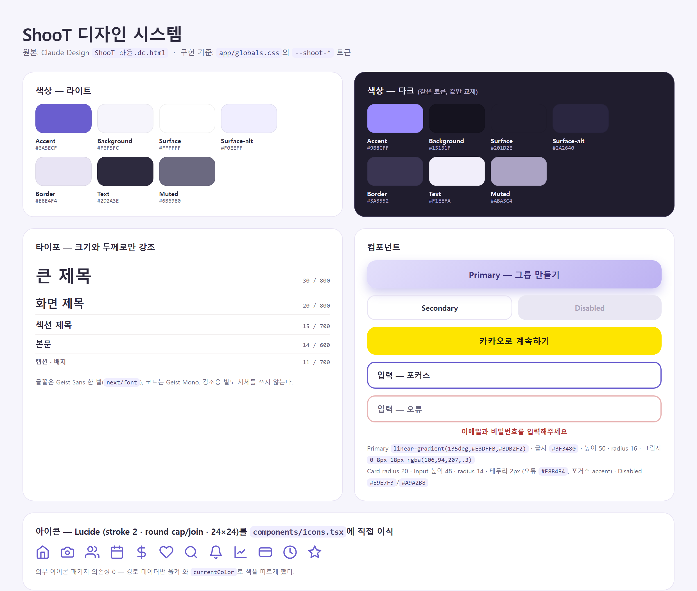

### 사용 도구와 역할

| 도구 | 어느 단계에 썼나 | 원본 여부 |
|---|---|---|
| 피그마 | 사용하지 않음 | — |
| Claude Design | 색·타이포·컴포넌트 정의부터 화면 생성까지 (`ShooT 하윤.dc.html`). 초안 23종으로 시작해 **최종본 36종** — 구현하면서 추가된 화면(펫·배지·월별 목표·그룹장 위임·정기 지출 관리 등)을 디자인에 역으로 반영했다 | **원본** |
| `app/globals.css` | Claude Design의 값을 CSS 변수(디자인 토큰)로 옮겨 코드의 단일 기준으로 삼음 | 구현 기준 |

### 정의

| 구분 | 정의 | 피그마 | Claude Design |
|---|---|---|---|
| 색상(라이트) | Accent `#6a5ecf`, Background `#f6f5fc`, Surface `#ffffff`, Surface-alt `#f0eeff`, Border `#e8e4f4`, Text `#2d2a3e`, Muted `#6b6980` | ✗ | ✅ |
| 색상(다크) | Accent `#9b8cff`, Background `#15131f`, Surface `#201d2e`, Text `#f1eefa` | ✗ | ✅ |
| 타이포 | 본문·제목 모두 Geist Sans (`next/font`), 코드 Geist Mono · 강조는 크기(11~30px)와 두께(600/700/800)로만 구분 | ✗ | ✅ |
| 아이콘 | Lucide (stroke 2px, round cap/join, 24×24 viewBox) — `components/icons.tsx`에 직접 이식해 외부 의존성 0 | ✗ | ✅ |

> 색은 전부 `var(--shoot-*)` 토큰으로만 쓴다. 다크모드는 `.shoot-app-root[data-dark="true"]`에서 **토큰 값만 바꾸면** 앱 전체가 따라 바뀌도록 설계했다.

### 컴포넌트 목록

- **Button** — Primary(보라 그라데이션 + 그림자) / Secondary(테두리만) / Disabled(회색, `cursor: 71efault`) / Kakao(브랜드 고정색 `#FEE500`)
- **Card** — `borderRadius: 20`, `1px solid var(--shoot-border)`, 항목 간 간격 10·16px 두 단계
- **Header** — 스택 화면용(‹ 뒤로가기 + 제목) / 탭 루트용(큰 제목 + 우측 액션)
- **Input** — 높이 48, `borderRadius: 14`, `2px` 테두리(오류 시 `#E8B4B4`, 포커스 시 accent)
- **TabBar** — 4탭 + 중앙 카메라 버튼(스택이 비었을 때만 노출)
- **PetMascot** — 원본 PNG + 부위별 픽셀 마스크로 색을 입히는 캐릭터 렌더러
- **Toast / FeedPopup / EmptyState**

### 디자인 vs 구현

피그마를 쓰지 않았으므로 **Claude Design 원본 ↔ 실제 배포 화면** 2단 비교다.

| Claude Design (`ShooT 하윤.dc.html`) | 실제 배포 화면 |
|---|---|
| 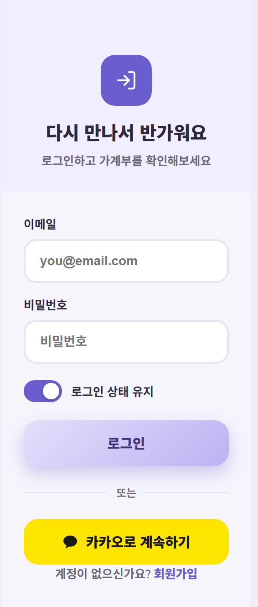 | 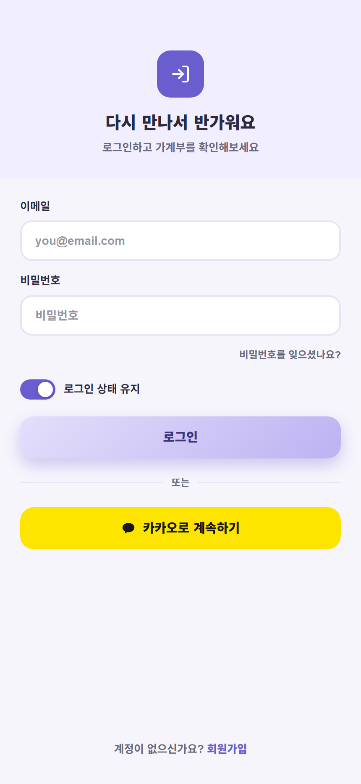 |
| 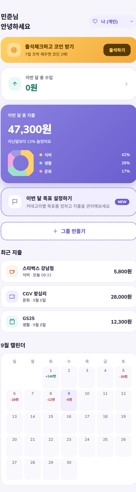 | 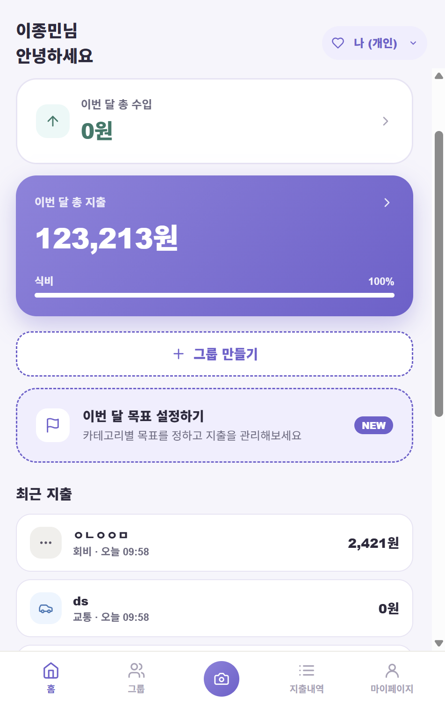 |

**로그인 화면** — 아이콘 타일·제목·입력칸 radius·"로그인 상태 유지" 토글·**카카오로 계속하기**까지 그대로다. 남은 차이는 하나 — 실제 화면은 비밀번호 칸 아래에 `비밀번호를 잊으셨나요?` 링크를 인라인으로 뒀는데, 디자인은 이를 별도 화면(2a-1 비밀번호 재설정)으로 그렸다.

**홈 화면** — 출석체크 배너, 수입 카드, 보라색 지출 카드(전월 대비 + **도넛 차트**), `이번 달 목표 설정하기`, 점선 "그룹 만들기", 최근 지출까지 순서와 구성이 같다. 남은 차이는 원본 맨 아래의 **월 캘린더** — 실제 앱은 이를 홈에서 빼고 별도 화면으로 옮겼다.

실제 화면 더 보기(로그인 후):

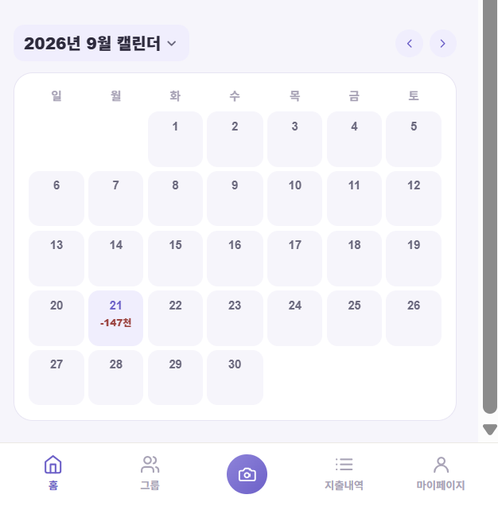 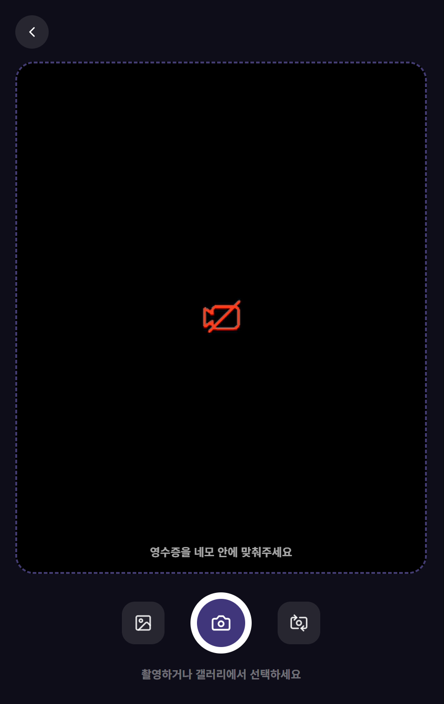 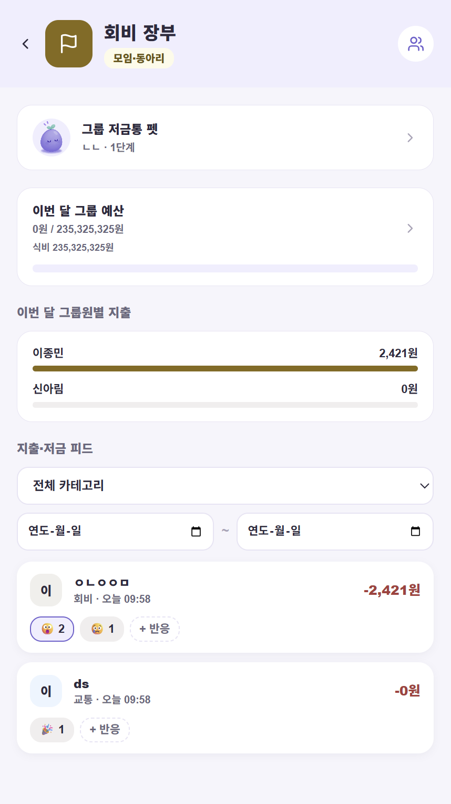 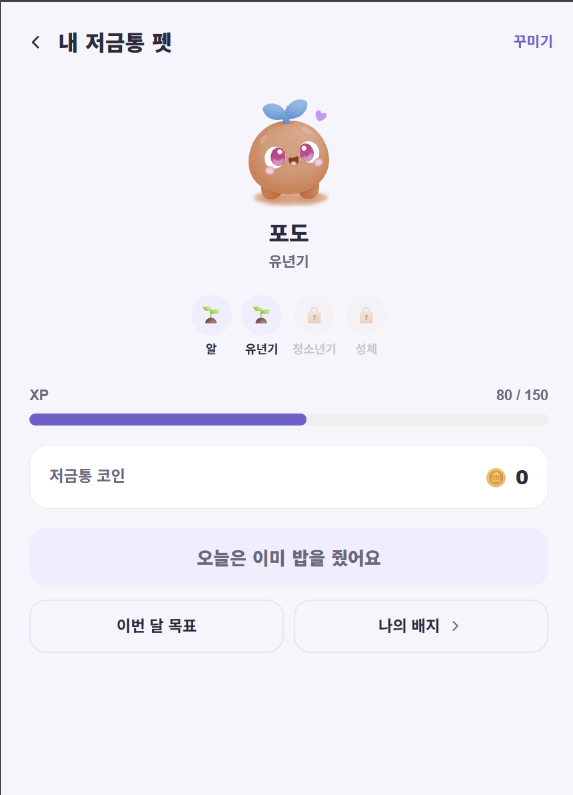 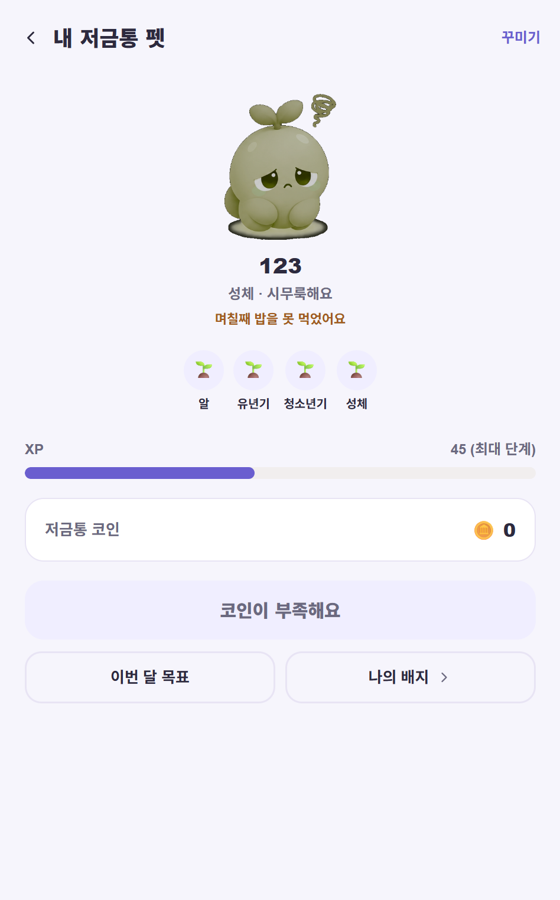

---

## 3. Agent 구성

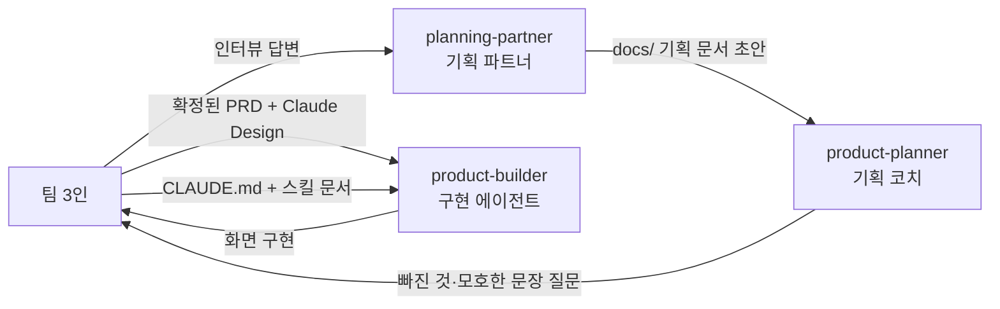

### 역할별 Agent

| Agent | 역할 | 입력 | 출력 | 제약 |
|---|---|---|---|---|
| **planning-partner** | 기획 인터뷰를 한 번에 한 질문씩 진행하고 답을 문서 양식에 받아 적음. 발산 질문으로 후보를 `[제안]`으로 보탬 | 팀의 구두 답변, 앞 문서(01→05) | `docs/0N-*.md` 초안·종합 문서 | 팀 대신 결정하지 않음 · 모르면 `[?]` · `docs/` 아래만 수정 (Read/Write/Edit) |
| **product-planner** | 기획 문서를 읽고 **빈칸과 모호한 문장을 질문으로 되돌려줌**. F↔R↔P ID 참조 검사(고아 ID 탐지) | `docs/` 기획 문서 | 질문 목록·참조 검사 결과 | 문서를 대신 쓰지 않음 · 답을 정해주지 않음 (**Read 전용**) |
| **product-builder** | PRD와 Claude Design 화면을 입력으로 실제 화면 구현 | `docs/PRD.md`, 디자인 파일 | 화면 코드 | 첨부에 없는 화면을 지어내지 않음 · 서버/새 폴더가 필요하면 만들지 말고 되물음 |
| **스킬 문서 5종** | `UI` / `CHARACTER` / `ANIMATION` / `ASSET_PIPELINE` / `DESIGN_SYSTEM` — 작업 종류별로 반드시 먼저 읽는 규칙집 | — | — | CLAUDE.md가 "작업 시작 전 확인 필수"로 지정 |

### 지시문 핵심 발췌

```
[planning-partner]
팀이 말한 것은 그대로 적는다. 말을 매끄럽게 고치지 않는다. 팀의 단어를 쓴다.
네가 보탠 것에는 반드시 [제안]을 붙인다. [제안]마다 근거 한 줄.
대신 정하지 않는다. "이걸로 하자"고 쓰지 않는다.
모르면 [?]. 짐작해서 채우지 않는다.
질문은 한 번에 하나만 한다.

[product-planner]
기획 문서를 대신 써 주지 않는다. 빈칸을 찾아 질문으로 돌려준다.
"편리하다·좋다·귀찮다"처럼 확인할 수 없는 문장은 원문을 인용하고 왜 확인할 수 없는지 적는다.
기능 문장의 주어가 앱이거나, 정책에 기술 단어(DB·API)가 들어 있으면 지적한다.
```

### 지시문 수정 이력

- **v1 → v2 (기획)**: 처음엔 에이전트가 빈칸을 알아서 채웠더니 팀이 말하지 않은 내용이 문서에 섞였다 → `[제안]` 태그와 `[?]` 규칙을 넣어 **출처가 팀인지 에이전트인지 항상 구분**되게 바꿨다.
- **v2 → v3 (기획 검토 분리)**: 쓰는 에이전트가 검토까지 하니 자기 문장을 통과시켰다 → **Read 전용 `product-planner`** 를 따로 만들어 질문만 하게 분리했다.
- **v3 → v4 (구현)**: 캐릭터 에셋 작업에서 에이전트가 원본 PNG를 덮어쓰거나 마스크를 다시 만들어 그림이 깨지는 일이 반복됐다 → `CLAUDE.md`에 **Golden Asset 보호 · 최소 변경 · 원인 확인 전 수정 금지** 조항을 넣고, 작업 종류별 스킬 문서 5종을 추가했다.

---

## 4. 프로젝트 규칙 (하네스)

### CLAUDE.md 핵심

`CLAUDE.md`는 44개 조항의 최상위 작업 규칙이다. 특히 중요한 것:

- **코드 컨벤션**: 주석은 한글(왜 그렇게 했는지 + 팀 결정 날짜를 남김), 변수·함수명은 영어
- **폴더 구조**: `app/`(라우트·API) · `components/screens/`(화면 컴포넌트 43개) · `lib/`(store·selectors·순수 로직) · `docs/`(기획) · `supabase/`(SQL 22개) · `scripts/`(마스크 생성·검증) · `.claude/agents/`(에이전트·스킬 문서)
- **Golden Asset 규칙**: `public/stage_*.png` 원본 캐릭터 이미지는 덮어쓰기·재생성·크롭 금지. 색 변경은 런타임 마스크 합성으로만
- **최소 변경 원칙**: "가방 경계 수정" 요청에 성장 로직을 건드리지 않는다. 기능 하나 고쳐달라는 요청에 전체 리팩터링 금지
- **원인 확인 전 수정 금지**: 현상만 보고 고치지 않고 Asset / Mask / Alpha / CSS / State 중 어디인지 먼저 분류
- **시각 우선 원칙**: 코드가 동작해도 경계선·누끼·정렬이 어색하면 완료로 보지 않는다 (100% / 200% / 풀스크린 / 애니메이션 프레임별 확인)

### 만들어 둔 Skill / 재사용 문서

| 이름 | 하는 일 | 사용 |
|---|---|---|
| `DESIGN_SYSTEM.md` | 임의 색·폰트·radius·그림자 추가 금지, 화면마다 새 버튼 스타일 금지 | UI 작업 전 상시 |
| `UI.md` | 화면 구조·간격·상태 표시 규칙 | UI 작업 전 상시 |
| `CHARACTER.md` | 부위 마스크·고정 색(코인 금색, 입) 보호 규칙 | 캐릭터 작업 12회+ |
| `ASSET_PIPELINE.md` | 마스크 생성·검증 스크립트 규약 | 마스크 재생성 시 |
| `ANIMATION.md` | 둥둥 뜨기·깜빡임·그림자 등 모션 원칙 | 애니메이션 작업 시 |
| `planning-partner` / `product-planner` / `product-builder` | 위 3절 참고 | 기획 전 구간 |

### 검증 절차

1. **매 변경마다** 아래 3단계를 순서대로 통과시킨다.

   | 명령 | 무엇을 잡나 |
   |---|---|
   | `npx tsc --noEmit` | 타입이 안 맞는 실수. `--noEmit`은 "파일은 만들지 말고 검사만 해라"는 뜻 — 숫자 자리에 문자를 넣었거나 없는 값을 참조한 경우를 여기서 잡는다 |
   | `npx eslint <변경 파일>` | 코드 스타일과 흔한 버그 패턴. 안 쓰는 변수, React 의존성 빠뜨림 등. 실제로 고친 파일 경로를 넣는다 |
   | `npx next build --webpack` | 진짜 배포 가능한지. 앞 둘을 통과해도 빌드가 깨지는 경우가 있다(서버 전용 코드를 클라이언트에 섞는 등) |

2. 캐릭터·마스크 작업은 `node scripts/verify-character-masks.js`로 13개 항목 자동 검증 + 실제 렌더 이미지를 눈으로 확인한다.
3. 화면 동작은 로컬 HTTPS 서버(`npm run 62ev:https`)를 띄우고 실제 계정으로 로그인해 확인한다. 서버 로그(`[account]`, `[receipt-ocr]` 등)에 원인 진단용 로그를 남겨 실패 지점을 특정한다. 또는 vercel의 각각 브랜치 도메인 링크를 통해서 직접 확인.
4. 잘못되면 **덧붙여 고치지 않고** `git status` / `git log`로 마지막 정상 커밋을 확인해 되돌린다 (CLAUDE.md 29조).

**실제 사례 1 — 캐릭터 부위 경계의 보라색 윤곽선**
에이전트가 마스크를 "색 범위(밝기·색조 임계값)"로 나눴더니, 부위 경계마다 어느 마스크에도 속하지 않는 픽셀이 남아 색을 바꿀 때 보라색 테두리로 드러났다. 200% 확대 QA에서 발견 → 판정 기준을 **"실제 오브젝트 경계(연결된 덩어리)"로 전면 재작성**하고, 검증 스크립트로 "임자 없는 픽셀 0개"를 자동 확인하게 했다.

**실제 사례 2 — 출석체크 연속일수가 매번 1일차**
"어제 날짜"를 `new Date(...).setDate(-1)` 후 `toISOString()`으로 구했는데, 한국(UTC+9)에서는 이 변환이 날짜를 하루 더 밀어 어제 기록을 못 찾았다. 사용자 제보 → 로그로 재현 → 타임존 안전한 `shiftDateKST()`로 교체하고 순수 함수 단위로 검증했다.

**실제 사례 3 — 그림자 마스크가 다리를 타고 올라감**
알파 페이드를 그림자로 판정하다 보니 다리 실루엣을 따라 3~4px 흔적이 남았다. 사용자가 다크 배경 스크린샷으로 제보 → 형태학적 opening(침식→팽창)으로 얇은 돌기만 제거하도록 고쳤다.

---

## 5. 협업 방식

### 브랜치 전략

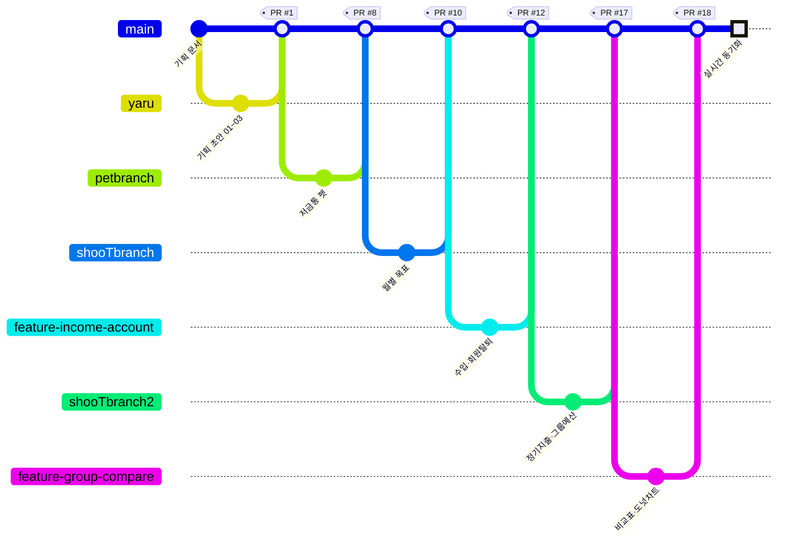

> 다이어그램의 브랜치 이름은 `/`를 뺀 축약형이고, `shooTbranch2`는 같은 브랜치를 두 번째로 쓴 것을 구분한 표기다(실제로는 같은 `shooTbranch`). 실제 이름 예: `feature/income-avatar-account-deletion`, `feature/group-compare-onboarding-donut-sort`. 맨 끝 `실시간 동기화`는 PR 없이 main에 직접 병합한 구간이다.

- **브랜치 종류**: `main`(배포용) / 개인 작업 브랜치(`mg`, `hybran`~`hybran7`, `hybranch`, `petbranch`, `shooTbranch`, `yaru`, `teamshy`) / 기능·수정 브랜치(`feature/<기능명>`, `fix/<버그>`, `docs/<문서>`, `draft/<문서>`)
- **이름 규칙**: 프로젝트 초반에는 **작업자 이름 기반**(`mg`, `hybranch`)으로 쓰다가, 후반에 **작업 내용 기반**(`feature/income-avatar-account-deletion`, `draft/hy-ledger-planning-01-03`)으로 옮겨갔다.
- **합치기 규칙**: 개인 브랜치에서 작업 → `main`을 먼저 merge해 충돌을 자기 브랜치에서 해소 → PR 생성 → `main` 병합

### 이슈 활용

**별도 이슈를 하나도 만들지 않았다.** GitHub Issues 탭에 뜨는 숫자는 전부 *열려 있는 PR*이고 순수 이슈는 0건이다. 이슈 템플릿·PR 템플릿(`.github/`)도 쓰지 않았다. 작업 단위는 브랜치명과 커밋 메시지로 나눴고, 결정 사항은 `docs/` 문서에 날짜와 함께 남기는 방식으로 대체했다. → 이 선택의 대가는 [7. 회고](#7-회고)에 적었다.

### PR 활용

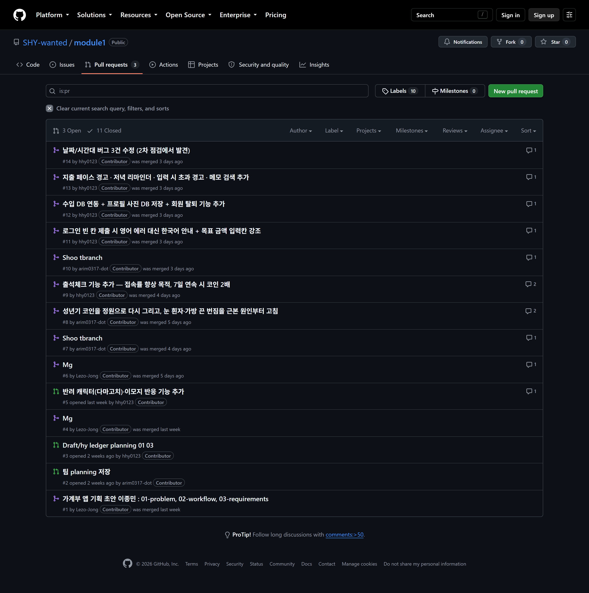

총 **PR 22개** (병합 18 · 열린 채로 남음 4). 계정명은 `Lezo-Jong`=이종민, `hhy0123`=황하윤, `arim0317-dot`=신아림.

| PR | 내용 | 브랜치 | 상태 |
|---|---|---|---|
| #1 | 기획 초안 01-problem·02-workflow·03-requirements | `yaru` | 병합 |
| #2 · #3 | 팀/개인 기획 문서 저장 | `teamshy`, `draft/hy-...` | 열림 |
| #4 · #6 | 캐릭터 에셋·마스크 파이프라인 1차 | `mg` | 병합 |
| #5 | 반려 캐릭터(다마고치)·이모지 반응 | `hybranch` | 열림 |
| #7 · #10 | 월별 목표 설정/삭제, 홈 카테고리 % 실제 계산 | `shooTbranch` | 병합 |
| #8 | 성년기 코인 재작업, 눈 흰자·가방 끈 번짐 근본 수정 | `petbranch` | 병합 |
| #9 | 출석체크 — 7일 연속 시 코인 2배 | `hybran` | 병합 |
| #11 | 로그인 빈 칸 한국어 안내, 목표 금액 입력칸 강조 | `hybran2` | 병합 |
| #12 | 수입 DB 연동, 프로필 사진 저장, 회원 탈퇴 | `feature/income-avatar-account-deletion` | 병합 |
| #13 | 지출 페이스 경고 · 저녁 리마인더 · 메모 검색 | `feature/pace-warning-...` | 병합 |
| #14 | 날짜/시간대 버그 3건 수정 | `fix/date-timezone-bugs` | 병합 |
| #15 · #20 · #21 | 펫 경제 개편, 밥 관련 버그, 시무룩 그림 재조정 | `hybran3`, `hybran4`, `hybran5` | 병합 |
| #16 | README 스크린샷·기록 정정 | `docs/readme-images` | 열림 |
| #17 | 정기 지출 · 그룹 예산 · 영수증 원본 재확인 | `shooTbranch` | 병합 |
| #18 | 그룹 지출 비교표 · 온보딩 투어 · 도넛 차트 · 정렬 | `feature/group-compare-...` | 병합 |
| #19 | 개인 펫 밥주기 하루 1회 제한 복원 | `fix/pet-feed-daily-limit` | 병합 |
| #22 | 정기 지출 빈 목록 아이콘 수정 | `hybran7` | 병합 |

- PR 본문에는 **무엇을 왜 바꿨는지 + 건드린 파일 목록**을 적었다. Approve 기능은 쓰지 않았고, 확인할 것이 있을 때 코멘트로 주고받았다(#8, #9).
- 막판 마무리(실시간 동기화 3건·그룹 멤버 버그)는 발표 일정에 맞추느라 **PR 없이 main에 직접 병합**했다. 브랜치는 떼서 작업했지만 리뷰 단계를 건너뛴 것이라, 규칙대로라면 PR을 거쳤어야 한다.
- 총 커밋 **163개**, 머지 커밋 **32개**, PR **22개**.

### 역할 분담

| 팀원 | 담당 영역 | 주요 작업 | 커밋 |
|---|---|---|---|
| 이종민 (형상관리자) | 캐릭터 에셋 파이프라인 · 외부 연동 · 하네스 규칙 · 실시간 | 마스크 생성/검증 스크립트, PNG+마스크 렌더러, 네이버 CLOVA OCR 영수증 인식, 카카오 로그인, 개인 랭킹, 그룹 펫 꾸미기, 13개 테이블 실시간 동기화, `CLAUDE.md`·스킬 문서 5종 | 85 |
| 신아림 (PM) | 기획 종합 · 목표(퀘스트) · 그룹 예산 | 01~03 기획 초안, 월별 목표 설정/삭제, 홈 캘린더 날짜 선택 바, 비밀번호 찾기, 정기 지출, 그룹 예산, 그룹장 배지, 기획 문서 현행화 | 23 |
| 황하윤 (리서쳐) | 리서치 · 디자인 원본 · 참여 유도 · 펫 경제 | `ShooT 하윤.dc.html` 디자인 원본, 출석체크(7일 연속 보너스), 반려 캐릭터·이모지 반응, 수입 DB 연동, 회원 탈퇴, 펫 경제 개편, 그룹 지출 비교표·온보딩 투어·도넛 차트 | 23 |

### 병렬 작업 방법

- **화면 단위로 나눴다.** 한 사람이 한 화면 파일(`components/screens/*.tsx`)을 맡아 서로 다른 파일을 건드리게 해서 충돌 면적을 줄였다.
- 공용 파일(`lib/store.tsx`)은 **함수 단위로 나눠서** 추가만 하고 기존 함수는 건드리지 않는 규칙을 뒀다.
- DB 변경은 기존 SQL을 고치지 않고 **번호를 올린 새 마이그레이션 파일**(`009_` ~ `020_`, 총 20개)만 추가하는 방식으로 서로의 스키마 작업이 겹치지 않게 했다. 프로젝트 내내 스키마 충돌이 한 번도 없었다.

### 충돌 해결 사례

- **월별 목표 금액 입력칸을 세 사람이 같은 시각에 수정** — 9/18 14:08에 세 명이 각자 "항상 보이는 테두리" / "강조 테두리 + 폰트 축소" / "눈에 띄게 + 추천 금액 계산 수정"을 자기 브랜치에서 작업했다. `main` 병합 시 같은 줄이 충돌 → 나중 PR(#11)에서 **한쪽을 되돌리고 하나로 합치는 커밋**("목표 금액 입력칸 테두리 강조 되돌리기")을 따로 만들어 정리했다.
- **저금통 펫 v2 통합(3개 브랜치)** — `mg`·`hybranch`·`shooTbranch`가 각자 다른 펫 스펙(성장 5단계 vs 4단계, 종 선택 vs 색상 커스텀, 주간 예산 vs 월별 목표)을 구현해 충돌했다. 코드로 먼저 합치지 않고 **충돌 지점 4개를 사용자에게 직접 질문해 결정한 뒤** 합쳤고, 결정 내용을 `docs/07-screens.md`·`PRD.md`에 날짜와 함께 기록했다.

---

## 6. 데모

**실행 방법**

- 배포본: <https://module1-two.vercel.app/>
- 로컬:
  ```bash
  npm install
  npm run 87ev          # http://localhost:3000
  npm run 114ev:https    # https://localhost:3000 (카메라 기능 테스트용 — getUserMedia는 HTTPS 필수)
  ```
- 필요한 환경변수(`.env.local`): `NEXT_PUBLIC_SUPABASE_URL`, `NEXT_PUBLIC_SUPABASE_PUBLISHABLE_KEY`, `SUPABASE_SERVICE_ROLE_KEY`, `CLOVA_OCR_INVOKE_URL`, `CLOVA_OCR_SECRET_KEY`, `KAKAO_ADMIN_KEY`
- Supabase: `supabase/schema.sql` → `002` ~ `020` 순서대로 SQL Editor에서 실행 (`fix_group_members_recursion.sql`은 `schema.sql`만 실행해 둔 기존 프로젝트를 고치는 용도라 새로 세팅할 땐 건너뛴다)

> **`019`·`020`을 빠뜨리면** 앱은 정상 동작하지만 실시간 반영만 꺼진다 — 조용히 아무 일도 안 일어나서 알아채기 어렵다. 확인 방법: `select tablename from pg_publication_tables where pubname = 'supabase_realtime' and schemaname = 'public';` 결과가 **13줄**이어야 한다.

### 강사 평가용 계정

시연에 쓰는 실제 계정과 **분리된 테스트 계정**이다. 비밀번호는 셋 다 공통 `test123`.

> 이 앱은 **이메일로 로그인**한다(별도 아이디 체계가 없다). 그래서 요청하신 아이디 `test123`·`test1234`·`test12345`를 그대로 쓰되 뒤에 `@test.com`을 붙인 형태다 — 로그인 화면에는 아래 이메일을 그대로 입력하면 된다.

| 계정 | 이메일 | 권한 | 이 계정으로 확인할 수 있는 것 |
|---|---|---|---|
| 팀장(그룹장) | `test123@test.com` | **그룹장(OWNER)** | 그룹 예산 설정·수정, 그룹 이름 변경, 그룹장 위임 |
| 팀원(그룹원) | `test1234@test.com` | **그룹원(MEMBER)** | 그룹 피드 조회, 본인 지출만 수정·삭제. 그룹 예산은 **읽기 전용** |
| 일반 사용자 | `test12345@test.com` | **그룹 미소속** | 그룹이 없을 때의 화면 — 공유 select가 아예 안 보임(P8) |

세 계정 모두 로그인 후 바로 볼 내용이 있도록 데이터를 넣어 뒀다 — 그룹장·그룹원 계정은 **강사 평가용 그룹**(초대 코드 `TEST01`)에 함께 속해 있고 공유 지출 3건과 그룹 예산 2건이 있다.

> **관리자 계정은 없습니다.** 이 앱의 권한은 `member_role` enum의 **OWNER / MEMBER** 두 가지, 즉 "그룹 안에서의 역할"만 존재합니다(06-data.md E3). 앱 전체를 관리하는 관리자 개념은 기획 단계부터 범위에 없었습니다. 위 세 계정이 이 앱에서 구분 가능한 권한의 전부입니다.

**권한이 서버에서 실제로 막히는지 확인한 결과** — 화면에서 숨기는 것이 아니라 Supabase RLS가 차단합니다.

| 그룹원 계정으로 시도 | 결과 |
|---|---|
| 남이 쓴 지출 수정 (P6) | 차단 |
| 본인 지출 수정 | 허용 |
| 그룹 예산 생성 (P14) | 차단 (42501) |
| 그룹 이름 변경 (P2) | 차단 |

계정 생성·삭제 스크립트: [scripts/seed-instructor-accounts.mjs](scripts/seed-instructor-accounts.mjs) — `node scripts/seed-instructor-accounts.mjs` 로 생성(여러 번 실행해도 안전), `--delete` 로 정리.

**시연 순서**

1. 카카오로 로그인 → 홈에서 **출석체크**(코인 획득) → 카테고리 **도넛 차트**로 이번 달 지출 비중 확인
2. 하단 중앙 카메라 → **영수증 촬영** → OCR이 상호명·날짜·금액을 자동으로 채워 저장 (인식이 어긋나면 원본 사진을 다시 띄워 대조)
3. **그룹 만들기**(유형 선택 → 이름 → 초대 코드) → 다른 계정으로 코드 참여
4. **실시간 확인** — 두 계정을 나란히 띄워두고 한쪽에서 지출을 저장하면, 다른 쪽 그룹 피드에 **새로고침 없이** 뜬다. 이모지 반응·그룹 예산 변경·펫 꾸미기도 마찬가지
5. 마이페이지 → **저금통 펫** 밥 주기(5코인) → XP·단계 성장 → **꾸미기**로 부위별 색 변경 → **나의 배지**, **개인 랭킹** 확인
6. **월별 목표**·**그룹 예산** 설정 → 지출 페이스 경고와 목표 리포트 확인

---

## 7. 회고

### 잘 된 점

- **기획 문서에 출처를 남긴 것.** `[?]`(팀이 모름)와 `[제안]`(에이전트가 보탬)을 구분해 적었더니, 나중에 "이거 누가 정한 거였지?"로 되돌아가는 일이 없었다. 거절한 후보도 「검토했으나 제외」 표에 이유와 함께 남겨서 같은 논의를 두 번 하지 않았다.
- **에이전트에게 "정하지 말라"고 못 박은 것.** 기획 에이전트가 결정을 대신하지 못하게 하니, 문서가 팀의 언어로 남았고 구현 단계에서 해석 차이가 적었다.
- **DB 변경을 번호 마이그레이션으로만 한 것.** 3명이 각자 스키마를 건드렸는데도 충돌이 한 번도 나지 않았다.
- **실패해도 저장은 성공(P7)이라는 정책.** OCR 정확도가 들쭉날쭉해도 "확인 필요"로 무조건 저장되니, 인식 품질 문제가 데모를 막지 않았다.
- **충돌을 코드로 먼저 합치지 않은 것.** 저금통 펫 v2에서 세 브랜치가 부딪혔을 때, 어느 쪽 코드를 살릴지부터 고르지 않고 **무엇이 충돌하는지를 4개로 정리해 팀에 먼저 물었다** — 펫을 하나로 합칠지, 성장 단계는 5단계인지 4단계인지, 마스코트를 통일할지, 주간 예산을 월별 목표로 대체할지. 답이 나온 뒤에 합치니 되돌리는 작업이 없었고, 결정 이유가 `docs/06-data.md`·`07-screens.md`·`PRD.md`에 날짜와 함께 남았다.
- **커밋 메시지에 "신고 → 원인 → 결과"를 적은 것.** 무엇을 고쳤는지만 쓰지 않고, 누가 어떤 증상을 신고했고 진짜 원인이 무엇이었고 결과가 수치로 어떻게 바뀌었는지(예: 마스크가 덮는 비율 88~96% → 91~97%, 임자 없는 경계 픽셀 5.8% → 0.6%)를 같이 적었다. 덕분에 이 README의 회고를 쓸 때 기억에 의존하지 않고 커밋 기록에서 근거를 그대로 꺼내 쓸 수 있었다.
- **기능이 다 된 뒤 2차 점검을 따로 돌린 것.** "동작한다"에서 끝내지 않고 완성된 코드를 한 번 더 훑는 단계를 뒀더니, 개별로는 잘 돌아가 보이던 날짜/시간대 버그 3건과 감사에서 나온 허점 5건(정기 지출 중복 생성, 코인 유실, 그룹 펫 동시성)이 한꺼번에 나왔다.

### 실패 사례와 개선

| 무엇이 실패했나 | 왜 | 어떻게 고쳤나 |
|---|---|---|
| 캐릭터 색 변경 시 부위 경계에 보라색 선이 남음 | 마스크를 색 범위로 나눠 경계 픽셀이 어느 마스크에도 안 들어감 | 판정 기준을 실제 오브젝트 경계로 재작성 + "임자 없는 픽셀 0개" 자동 검증 |
| Vercel 배포가 계속 실패 | `.env.local`은 git에 안 올라가는데 Vercel에 환경변수를 등록하지 않음 | 4개 변수를 Production/Preview/Development 전부 체크해 등록 후 **재배포**(기존 배포엔 소급 적용 안 됨) |
| 카카오 로그인 후 `localhost`로 튕김 | Supabase의 **Site URL**이 `http://localhost:3000`이라, 배포 주소에서 로그인해도 거기로 돌려보냄 | Site URL을 배포 주소로 바꾸고 Redirect URLs에 `https://module1-*.vercel.app/**` 와일드카드 추가 |
| 월별 목표 삭제 버튼이 눌러도 안 됨 | `category_goals` 테이블에 **DELETE RLS 정책만 빠져** 있었음(RLS는 정책 없으면 기본 차단) | `010_category_goals_delete_policy.sql` 추가 |
| 영수증 OCR이 자꾸 인식 실패 | 무료 커스텀 템플릿 방식은 좌표로 판정해서, 영수증이 조금만 기울거나 잘려도 매칭 실패 | 안정적인 종이 영수증만 지원 범위로 좁히고, 간편결제 캡쳐는 범위에서 제외. 인식 실패 시 수동 수정 경로를 보장 |
| 회원 탈퇴 후 카카오로 다시 로그인하면 동의 화면이 안 뜸 | 우리 DB의 계정만 지우고 **카카오 쪽 연결은 안 끊었음** | 탈퇴 시 카카오 unlink API도 함께 호출(실패해도 탈퇴 자체는 진행) |
| **같은 입력칸을 세 명이 같은 시각에 고침** — 9/18 14:08에 세 사람이 각자 "목표 금액 입력칸"을 수정한 커밋을 올렸다 | 브랜치는 나눴지만 **화면 담당자를 정하지 않았다.** "금액 입력칸이 눈에 안 띈다"는 같은 피드백을 세 명이 각자 받아 각자 고쳤다 | 21분 뒤 한 명이 되돌리는 커밋(14:29)으로 하나로 합쳤다. 이후로는 같은 화면을 한 사람이 맡도록 나눴다 |
| **타임존 버그가 1차 점검을 통과했다** — 출석 연속일수·저녁 리마인더·페이스 경고가 각각 다른 증상으로 어긋났다 | "오늘 날짜"를 **모듈을 불러올 때 한 번만 고정**하는 패턴이 세 곳에 복사돼 있었다. 증상이 제각각이라 처음엔 서로 다른 버그로 보였다 | 2차 점검을 따로 돌려 3건을 한 번에 찾았고, 날짜를 쓸 때마다 다시 계산하도록 통일했다 |
| **기획이 구현 중에 바뀌었다** — 모임 유형 "룸메이트"→"친구", 성장 5단계→4단계, 주간 예산→월별 목표 | 세 브랜치가 **각자의 전제로 먼저 구현한 뒤에야** 서로 다르다는 게 드러났다. 기획 문서에 적히기 전에 코드가 먼저 나간 부분이 있었다 | 충돌 지점 4개를 코드로 합치기 전에 팀에 물어 결정하고, 정한 내용을 날짜와 함께 기획 문서에 반영한 뒤 병합했다 |
| **공유 가계부인데 새로고침을 해야 서로가 보였다** — 초대를 받아 들어가도 멤버 목록에 자기 혼자였다 | 데이터를 **로그인 직후 한 번만** 읽는 구조였다. 실시간은 지출 알림 하나에만 걸려 있었고, 그마저 토스트만 띄우고 목록에는 넣지 않았다 | 참여 직후 그룹 멤버 전체를 다시 읽게 고치고, 화면이 읽는 **13개 테이블을 전부 Realtime으로** 구독하도록 바꿨다(`019`·`020` 마이그레이션) |

### 팀 안에서 공유한 Claude 활용 노하우

- **기획은 "쓰는 에이전트"와 "검토하는 에이전트"를 분리한다.** 같은 에이전트에게 쓰게 하고 검토시키면 자기 문장을 통과시킨다.
- **규칙은 대화가 아니라 파일에 적는다.** 같은 지적을 세 번 하면 `CLAUDE.md`나 스킬 문서에 조항으로 넣는다.
- **실패하면 로그부터 남긴다.** 서버 라우트에 `console.error("[account] ...")` 같은 태그 로그를 먼저 심고 재현시키면, 추측 없이 원인을 특정할 수 있다.
- **"고쳤다"는 말 대신 검증 명령을 붙인다.** `tsc` → `eslint` → `build` 통과 결과를 항상 같이 보고하게 했다.

### 다음 프로젝트에서 다르게 할 것

1. **환경변수와 외부 서비스 설정을 1일차에 체크리스트로 만든다.** 이번엔 Supabase URL 설정, Vercel 환경변수, 카카오 Redirect URI, SQL 마이그레이션 실행 누락으로 같은 유형의 디버깅을 네 번 반복했다.
2. **이슈·PR 템플릿을 처음부터 만들고, 화면마다 담당자를 한 명만 둔다.** 브랜치명만으로는 누가 무엇을 하는지 겹치는 걸 못 막았고, 실제로 같은 입력칸을 세 사람이 같은 시각에 고쳤다. 막판에는 일정에 쫓겨 PR 없이 main에 직접 병합하기도 했다.
3. **외부 API는 "유료/무료 경계"를 붙이기 전에 확인한다.** OCR 특화 모델이 Free 플랜 예외가 없다는 걸 연동 후반에 알아서 무료 대안으로 되돌아가는 비용이 컸다.
4. **브랜치 이름을 처음부터 작업 내용 기준으로 통일한다.** 초반의 사람 이름 브랜치(`mg`, `hybran`, `hybran2`)는 나중에 어떤 작업인지 추적하기 어려웠다.
5. **"여럿이 같이 쓴다"는 전제를 1일차 설계에 넣는다.** 공유 가계부를 만들면서 데이터는 로그인할 때 한 번만 읽는 구조로 짰다. 기능이 거의 끝난 뒤에야 "새로고침해야 서로가 보인다"는 게 드러나서, 막판에 13개 테이블을 실시간으로 바꿔야 했다. 혼자 쓰는 앱이면 안 겪었을 문제다.
